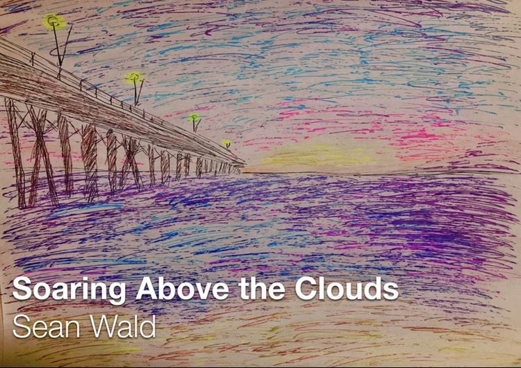

# Sean Thomas Orion Wald: Who Am I & What Do I Do?
Hey! My name is **Sean Thomas Wald**, and I'm a *Producer, Multi-Instrumentalist, and Singer/Songwriter!*

[LinkTree](https://linktr.ee/thomaswald) for all platforms

---

## About Me

I've been playing guitar from the age of 6, and ever since then I've had a passion both for playing music, but also writing it. I think as every writer's story goes: my initial songs were objectively terrible, and very hard to listen to; but this didn't stop me from writing, so I kept making new songs, picking up new instruments along the way, and eventually got to where I am now!

Some of my biggest inspirations are *Gary Clark Jr. , Royal Blood, Highly Suspect, Iration, Jimi Hendrix, Reignwolf, Trivium, and the Blue Stones*. I love making blues rock although I never limit myself creatively, from making a `Metal Album` to making an (upcoming) `Electronica` album.

Also to clear up the air, the artist `Sean Wald` is where I release all the instrumental music I have made, usually in the form of albums and because of this it has a much quicker turn around time and is generally more fun to make. The artist `Thomas Wald` is where I release all my music featuring vocals, usually in the form of singles, and heavily promote my music. Due to the complexity of mixing and mastering vocals, these tracks take quite a bit of time, but in comparison to Sean Wald they always out-preform (My highest streaming song *Crossroads* , has nearly **10,000 Streams!** )

Here's a 
[general link](https://linktr.ee/thomaswald)
to all my music, but for specific informtaion about each seperate artist, what goes behind making the music, each song, and a little about each song, read below; 

## Recent Release - Tales Under the Twin Suns (Feburary- 2022)

This album took me about **5 years** to make, starting all the way back in **2017**. It started with an idea that I'd make a progressive metal album, but I had neither the skills nor the tools to complete this idea. 

*However*, 4 years later, after I had proved I could produce the music I had always envisioned in my head, *I returned to my former dreams*, and set my eyes on making this album. Through actual tears and sweat - which included (but not limited to) `getting my computer wet and therefore losing every single song I had ever made` - I was finally able to complete the album (with a little help from my friend/mentor/teemate/producer:
[Derek Cote](https://linktr.ee/varisonus)
)

As much as I'd like to tell you all about how amazing this album is and what it sounds like, in my opinion it's impossible to try to describe music in words, so give it a 
[Listen](https://open.spotify.com/album/5KCDV9yw0oyKq3Ucib9A0V)
! (please :D )
# Thomas Wald - Artist
As stated previously, the artist `Thomas Wald` is where I release all my **singles/songs** featuring **vocals** and **heavily promote my music**. 

For each single I make under `Thomas Wald` it generally takes anywhere from **a month** to up to **a year** just to fully *produce and release songs*, including promotional images and videos as well as getting everything in the track to meet streaming standards.

As stated, for Thomas Wald releases, I send them off to my producer
[Derek Cote](https://open.spotify.com/artist/1vCJJaoYrRpzzjlf5Ty568) (Varisonus)
so they can sound absolutely perfect. This added process takes copious amounts of time, but the end result is worth it, especially compared to the music released on `Sean Wald`
## Music

### All Releases

[Red](https://open.spotify.com/album/2F2L5adkWrYFbLuhRpt3wA) - Varisonus Edit *(September 18, 2021)*

[[Red]](https://open.spotify.com/album/70YU0lmfHNzkB6WohSnbEH)
*(August 20, 2021)*

[Golden](https://open.spotify.com/album/10XInRlKVxGHK3LYZFoXbx)
*(June 26, 2021)*

[Crossroads](https://open.spotify.com/album/2tp50H2DMpHFGoJP6B27bA)
*(May 28, 2021)*

[Voodoo Magic](https://open.spotify.com/album/2pBwwBXqoFgbrAiYREbMxN)
*(March 19, 2021)*

[Are You Satisfied?](https://open.spotify.com/album/2dshdD5cukMS9pjWsoo7OP?si=5GP_MBuOSwacxSavgAcTzQ)
*(January 27,2021)* 

### Behind the Music
**Red**
> Recently, I've been getting a lot of what I can only characterize as Panic Attacks. My chest would start to hurt as if I had heart-burn on steriods, and it was hard to breathe. Always looking for new topics to write about, I decided to write about my experiences in facing these moments of panic (writing about trauma is something of a crux for me as you'll come to see). Lyrics such as "*the walls are closing in*", "*the nightmare won't end*", "*these voices in my head are telling me I should be dead*", all describe what I was feeling in the moment. I hoped in singing about this it'd not only give light to my experiences but also help those who were going through similar things, so maybe they could relate to what I was experiencing. Red was mixed & mastered by the afromentioned [Derek Cote](https://linktr.ee/varisonus), this song just recently hit **over 1,000 Streams!**

**Golden**
> For sake of anonymity, I'll try to keep the background as vague as possible, but around the time of this release, my ex broke up with me, and this was my way of coping: writing. It's about struggling to move on, but accepting it while still remembering the good memories, which in my life has been something I've had difficulty with.
> `Anyways`, *this song just hit* **over 2,000 Streams**, so obviously **Trauma is Profitable, Q.E.D.** (I hope I don't need to say this but this is a joke). 
> Recorded, Produced, Mixed & Mastered by Me.

**Crossroads**
> There have always been times in my life where I hated myself, times where I had really negative thoughts, and this song is an expression of it. It plays out like a story, where the subject (me), goes down to the crossroads, only to find a dismal ghostly spirit, who informed the subject that he was waiting for all the suffering to end, and he was the "*demon inside [him]*". After this confrontation, he goes to a river where he doesn't see his own reflection, but rather "*the devil's eyes starring back at [him]*". The story of crossroads not only depicts the downward spiral of the main character, as he finds out he is the devil, but also serves many thematical purposes. Firstly, the `devil's eyes` are both a reference to how I was feeling about myself - thinking I was the devil and I was generally upset with myself, but also a reference to how we all this inherent evil inside of us, and we can either overcome it or give in to it. At the time of making this and by the ending of the song, it is pretty clear I gave into this demon inside me, however, in future woks, I plan to express how I overcome this.
> *Crossroads* is to date my most popular song, with **over 10,000 Streams!**. Recorded, Produced, Mixed & Mastered by Me.

**Voodoo Magic**
> I wrote this song because I was head-over-heals for someone, as seen by the lyrics "*...and I don't even care, cause I've been lost...without you*". In retrospect, this is probably my worst song simply because of how poorly it was produced (by me ofc) & how mediocre my singing was at the time, which I have since improved.
> Probably not surprisingly either, Voodoo Magic is my least popular (Thomas Wald) release to date, with somewhere between **500-750 total streams**. 
> Recorded, Produced, Mixed & Mastered by Me.

**Are You Satisfied?**
> `This song is a cover by Reignwolf's song of the same name`. I thought that was important to say given it seems a lot of people who know me and listen to my music are under the impression I made this song, **I did not**, although I did cover it because it was such a good song (and while you're here, why don't you go check out [Reignwolf](https://open.spotify.com/artist/66YGDwn22fjphzqGCSIbbK)). 
> *Are You Satisfied?* (by Thomas Wald) has **over 5,000 Streams!**
> Recorded, Produced, Mixed & Mastered by Me.

## Image Gallery

From left to right;
1) *Voodoo Magic*
2) *Crossroads*
3) *Are You Satisfied?*
4) *Red* 

---

# Sean Wald - Artist
The artist `Sean Wald` is where I release **all my music** usually *without vocals*. Because of the lack of vocals, the songs become less marketable, thus `I don't count the streams on these releases`. **However**, because of the lack of vocals it allows me to not only make & release music at a much faster rate, but also allows for me to push my sonic boundries.

Most recently I released *Tales Under the Twin Suns* under the Sean Wald name. As stated previously, it was a progressive metal album, which up until this point I have been unable to do.

Right now, on top of working on some new Thomas Wald material, I am trying to both make the next edition of the *Route 66/Soaring above the Clouds* anthology and also make an electronica album, featuring no guitars whatsoever, and more focused on the production side of music.

Everything under the artist Sean Wald is Recorded, Produced, Mixed & Mastered by Me

## Music

### All Releases

[Tales Under the Twin Suns](https://open.spotify.com/album/5KCDV9yw0oyKq3Ucib9A0V) *(Feburary 24, 2022)*

[Soaring Above the Clouds](https://open.spotify.com/album/6BKitzcDAjaBMA9OiBCaNx) *(April 3, 2021)*

[Route 66](https://open.spotify.com/album/3qAUQGiCzl3krNaQrdafCZ) *(August 29, 2020)*

### Behind the Music
**Tales Under the Twin Suns**
> This album took me about **5 years** to make, starting all the way back in **2017**. It started with an idea that I'd make a progressive metal album, but I had neither the skills nor the tools to complete this idea. 
> *However*, 4 years later, after I had proved I could produce the music I had always envisioned in my head, *I returned to my former dreams*, and set my eyes on making this album. Through actual tears and sweat - which included (but not limited to) `getting my computer wet and therefore losing every single song I had ever made` - I was finally able to complete the album (with a little help from my friend/mentor/teemate/producer:
[Derek Cote](https://linktr.ee/varisonus)
)
> The album follows a man and his journey up mount Fuji, where he encounters several beings and experiences which forever change his worldview. Once he finalls crests the summit fo the mountain, only hell awaits him on the otherside.
> 
> Also yes the `Twin Suns` is a *Star Wars* reference.
> Recorded, Produced, Mixed & Mastered by Me

**Standout tracks:**
> *Seii Taishogun*
>> This nearly `8 minute song` details the life of *Seii Taishogun*, which actually is the title of the Shogun in japan. This song was a lot of fun to make, as not only does it have very *quiet verses* with **grand, pounding choruses**, but also the drums were very fun to track, especially in the bridge where the song changes from 3/4 to 4/4.

> *The Dance of Blue & Red Dragons*
>> This track is actually a reference to Avatar:*The Last Airbender*, in that the fight between Zuko and Azula is akin to Blue & Red dragons, and the dance being the fight. This song was also really fun to make, specifically because of the chorus, which not only switch out of *3/4 to 4/4* but also let me go crazy with the drum fills.

> *47 Ronin*
>> For the last song of the album, I had to go grand, so what better way than to make a `15 Minute Long Epic` about the old japanese folktale of the same name. This song was insane to make, it ended up with around 100 tracks, but was also very rewarding. From using oriental drums (Gong etc.) to perfectly figuring out how to overlay tracks with different tempos, this track is probably my **Magnum Opus**. I just hope I stayed respectful to the source material

**Soaring Above the Clouds**
> This album actually took me a lot longer that it seems, as I actually started formulating (and writing it) about a year prior. I even released a very different version of this album around October of 2020, however I deleted it due to song issues. This album picks up where *Route 66* left off, with overcoming trauma you're still left to pick up the pieces in your life, which is what the album details, In the end, I hope to have gotten in a better place than I was before, learning that forgetting the past is counter-productive, as it is a part of me, and understanding that I am defined from my experiences.

**Standout tracks:**
> *Red Heart*
>> This song was actually written for an english project, where we analyzed a character from the book *Beloved*. The themes of beloved - overcoming trauma by fully understanding your past & integrating it into yourself - were incredibly similar to the themes I was writing about in this album, so I decided to include it on here, which turned out to be a great decision. This song was absolutely inspired by the greats like *Jimi Hendrix* and *Gary Clark Jr.*; The main riff was actually a play on inverting the riff from the song `When My Train Pulls In` by *Gary*. aside from it being fun to make, it also pushed my boundried with drums, as in this song I can pinpoint exactly I finally figured out what the snare was used for in terms of songwriting & feel and how to use it.

> *Sandcastles*
>> This song was written all the way back in 2019, and it was about how I just wanted to escape the problems in my life. It is very meaningful to the themes of the album as it's part of the journey of getting your life back together after overcoming trauma. When we finally deal with what's honeding us back, it can be hard to adjust to normalicy, given we've been dealing with this trauma for such a long time. Sometimes we relapse, and that's ok, so long as we *take the next step forward, we'll always move past where eventually*.

> *Soaring Above the Clouds*
>> In 2009, my dog died. However being 6 at the time and moving to a new place, I never really had any time to process it at all. 11 years later, I came ack to this moment to both give myself closure on this event, and to wish my dog well. My hope for this song was not only personal: to finally let go of the death of my dog which I had neither the time or emotional capacity to mourn, but also to help relate to others who may be going through loss as well. You're not alone, and everythng will be ok eventually, whether that be a day, a week, a month, a year, or a decade, so long as we move forward we will get there.

Rest in Peace Mocha, I hope where ever you are, you're happy, and someday I'll find you Soaring Above the Clouds 

**Route 66**
> While this was **not** the very *first album* I had every made (in fact I had made **10 previous album** to this, and this album was a *compilation of those albums* of sorts), it was the first album to feature a *full array of sounds*, including: *guitars, bass, drums, keys, & organs*, and was subsequently **the first album I released everywhere**. This album tells the story of me dealing with all my trauma. Again I will not get into specifics, but I dealt with certain things in my life that broke me. So while the album starts off light in *Phoenix, Surfin' Along, and Voodoo Magic*, it quickly turns dark by *Wings*, then what I canj only describe as meding in the final act, culminating in *Route 66* (the song), which I'll get to in a bit

**Standout tracks:**
> *Sunset*
>> This track is the 1st of the 2-parter *Sunset/Sunrise*, and is kinda a call for help. It is the darker of the two, starting off slow for the first 3 mins but then picking up by the 5 minute for a very loud solo. In terms of dynamics, this song pushed me tremendously as I has to make the quiet parts sound full while also not oversaturating the loud parts. In retrospect, that seems very trivual, but for all production I was self taught, and so this was a big step for me.

> *Sunrise*
>> This track is the 2nd part of the 2-parter *Sunset/Sunrise*, and feels like a big sigh of relief after the last one. It is far more calm, and actually switches to the Major scale instead of the Dorian scale to have a sence of release and peace. This song was genuienly written about sunsets at the time, but as time progressed it took on a new meaning of being a reaffarmiation that I'll be ok.

> *Route 66*
>> This song was written in early 2019, and it was written after I tried to kill myself for the last time. Throughout, I gave the soundscape a more hollow and empty mood to match what I was feeling of wanting to be alive but not being able to see the sky. However by the end, the soundscape becomes completely filled up, with me realizing I want to live, and I should live, and ends back where it started, but this time with a new sense of self, after overcoming my suicidal thoughts. This song ends the whole album on a positive note, that if I just keep mving forward, someday I'll be ok, which is what the Anthology of albums is (hopefully) building towards

## Image Gallery

...
# Live Preformamces
I have not done any live preformances yet, but when I do I'll add them here
