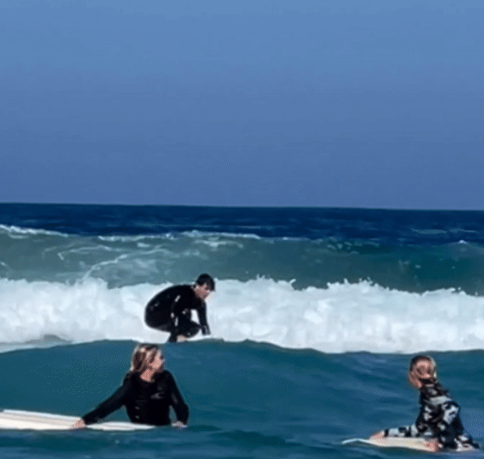
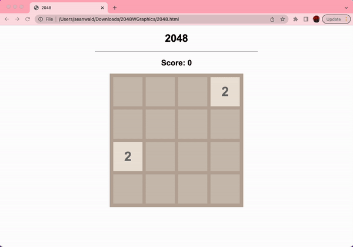

# Sean Thomas Wald

## Introduction
Hello! I am **Sean Thomas Orion Wald**, **full time student at UCSD**, currently pursuing a **BA in Mathematics & Computer Science Engineering**. While I am a Sophomore in time only, I am a Junior in standing and expect to graduate by June 2024 (normally, this would be around June 2025). 

When I'm not giving it 100% at school, I can be found *playing badminton* for the UCSD Badminton Club, *recording music* at my home studio, *playing venues* live @UCSD, *swimming* at the UCSD Rec Pool, *cycling & running* around the La Jolla area (I'm training for a triathlon right now), *surfing* on La Jolla cove, or in a Geisel library, either *coding pet projects of mine or reading* a book. Additionally, I am *applying to become a volunteer* at the Human Society in San Diego (check them out, you won't regret it)! You can find more information about all of these below, but I hope this gives you insight into the kind of person I am: **I am very energetic and creative, but I am also very disciplined to get the work I have done.**

If you are reading this, it is probable that you additionally *have a copy of my resume*, hence **I will avoid reciting what is presented on there, such as awards and accolades & relevant courses taken in High School & College**, as not only would it be a waste of time but additionally **I do not believe boasting all my academic achievements would reflect well on me nor do I find bosting accurate to the who I am.**

//future patch: place images here, 1 of cycling, surfing, etc.

## Physical Activities 
### Triathlons (Running, Cycling, Swimming) 
>Triathlons and I have a long history. In 2015, I started doing them (because my parents signed me up) and love them. In the Arizona Triathlon Series for the 2015 year, I ended up in 3rd place overall for my age group, and usually ended up in the top 5 in each individual race. However, tragedy struck the next year, when my coach got sued and was forced to disband the club. After that, I never really went back to triathlon, however I did continue each sport independently; Notable: being the captain of the Farmington Youth Cycling Club (CCC) in 2020, racing for the Simsbury Trojans Varsity team in 2018 and 2019, and competing on the Simsbury Varsity Cross Country team in 2020 (albeit, not receiving any varsity letter to my chagrin).

>Although I've never looked back, recently I've been having that itch again: I really want to do a triathlon, and more than that, I want to be better at them than I was when I was 12. Sounds easy? Its not. Like I said, 12y/o me was a speed demon, he got 3rd place overall in his first (and only) year! That's some Ethos I gotta live up to, but I'm ready to meet that challenge!

>Currently, I am training for the San Diego Spring Sprint on March 7th. For those who don't know, that's a 400 meter swim, followed by a 12k on bike, appended by a 5k run. That's kind of a lot, trust me I know! 

>To train for this, I have been running 5k+ on Sundays and Wednesdays, biking about 12 miles (~17k) on Mondays and Fridays, and swimming for an hour (which ends up being about ~1000 meters) on Tuesdays and Thursdays, with Saturday being my off day (at least, it would be if I didn't surf those days).

>Just recently, I hit a new 5k PR at 20:00! Lets hope I can carry that wind with me into the race!

### Morning Routine
>Unlike a lot of my friends, I'm a very early bird; I believe the mornings are the most important and underutilized time of the day. I start every day at around 5-6am by taking my Vitamin Pills from Costco (See image), and then go into a 15 min Ab workout. This workout is heavily inspired by [Chris Heria](https://www.youtube.com/@CHRISHERIA), (specifically this [video](https://www.youtube.com/watch?v=yVQF_Vr_XCE)). I believe this to be a perfect start to the day by getting blood flowing and by eating those vitamins!
### Badminton
>As an official member of the UCSD Badminton Team, it is my job to inform you that I am not very good. I only just recently started Badminton, but have already fallen in love, and all though I was required to tell you I am not good, I am getting better and hope to someday be able to return a smash!

## Coding Projects

Here is a complete list of every coding project I have done thus far (January 23rd, 2023). Hopefully, more to come soon!
### 1. 2048 Python/Terminal V3.1 (December 2022)
Idea: Create the game 2048 (see [2048](https://play2048.co/)) in Python as a playable game on terminal. 

Goals: 
>Learn Python syntax. 

>Make a functioning terminal game. 

>Optimal runtime.

Challenges: 

>initially, the hardest part was creating the logic for this game. The Basic Data Structure for the game is a 2D array, with each value being randomly assigned and moved around in the grid. Moving tiles, was tricky, as left wise it makes since (as that is generally how they are displayed in every programming language), but if I wanted to shift tiles right, I would have to do very complicated methods. However, I can to the simple solution of simply reversing the array and doing a left shift, that way everything was very neat. Similarly, for up and down, I simply transposed the arrays and reversed then if necessary to make them into a simple left shift, them transposed and reversed them back into proper order. More vague problems can be seen below

> Version 1.0 would not run due to too many files. Compiler had no idea what to look at and when. Must be completely redone

>Version 2.0 would compile but not run at all. Compiler was never getting to start function.

> Version 3.0 would compile and run, minor issues regarding tile movement where tiles would not move at all except for left

Known Bugs:
>Version 3.1: Sometimes if moving tiles a direction with a space between any 2 given tiles, once moved space will remain.

>Version 3.0: Only left function works

>Version 2.0: Only initial code executes

> Version 1.0: Code does not execute

Potential Future Updates:

>In the future, I would like to fix the big mentioned in 3.1, so that tiles move properly when commanded. Further, I would also like to add a score counter, and a reset button command, so the game does not need to be rerun every time I want to play a new game

Download Link:

>2048 Game (executable file): <a href="2048.py" download>(2048.py) Click to Download</a>

>2048 Helper (required - contains all functions): <a href="bruhHelper.py" download>(bruhHelper.py) Click to Download</a>

To play this on terminal, simply download both files, place them in the same folder, and then use the run commands on 2048.py!
### 2. 2048 HTML/CSS/JavaScript V1.0 (January 2023)

Idea:

> use the logic previously and attempt to code 2048 to be more visually appealing and similar to the original game. Also, vaguely learn CSS and JavaScript

Challenges:

> Starting this project I did not know and CSS or JavaScript. The learning curve is very tough, as while all the logic is practically the same as it was in C, Java, or Python, the integration into HTML is very confusing, and illuminated a lack of understanding of HTML on my part, which I hope to make better in the next few projects. 

Known Bugs:

> No "End", game only ends at reload, cannot autodetect defeat or win scenarios.

Potential Future Updates:

> In the future, I'd like to add an end screen pop up, which includes a replay button, which also entails a win/loss detection system. Given how all the logic for this is already present in the Python version, the hardest aspect of this will be to graphically assign all of these scenarios. Further, in the far future, I'd like to add motion graphics to see the tiles sliding. However, that is not immediate.

Download Link:

>[Link](https://crustaceanking.github.io/Thomas-Wald/2048.html) to working 2048 game made by me

>2048 html file: <a href="2048.html" download>(2048.html) Click to Download</a>

>2048 JavaScript file: <a href="2048.js" download>(2048.js) Click to Download</a>

>2048 CSS file: <a href="2048.css" download>(2048.css) Click to Download</a>
### School Projects (C, Java, Arm-32 Assembly)
>Initially I had downloadable links available to all my projects completed for school on github as repositories, so anyone could run them and see what I had done. **HOWEVER**, I have been informed this is a **violation of academic integrity**, as anyone who takes those classes after me could pull my repositories and use my code as their own. 

>With that said, I do want to show my code, so I will be attempting to describe my projects as well as attach images to them to demonstrate what they do and explain my code. I **CANNOT ATTACH MY CODE**, and at the moment no longer have access to some of the files and remote storage system I previously used, so this will take a bit of time. I will provide constant updates.

## Music
### Brief Intro/Overview

>I have been making music for quite awhile now - my first (released) album was all the way back in 2020, but my first actual album was made and archived all the way back in 2017/18! That is to say, although I've been doing it awhile, I still have a lot to learn. I won't go into much detail, as there is already [another page](https://crustaceanking.github.io/Thomas-Wald/About.html) where I went into too much detail, so if you'd like to learn more and maybe hear some of what I've done, you can check it out.

## Yearly Book Count & Review
### 2023 New Years Resolution
>For the new years I one goal: to become healthier, more mindful, and smarter than I had ever been. I've already discussed this a bit in the way of triathlons, but 2 other goals with this were: (1) to read a minimum of 30 books this year, and (2), to stop using social media.

>To keep it short, I was chronically addicted to social media - Instagram, Youtube, even Twitter at one point (with the Andrew Tate Fiasco), and it destroyed my mind. I was becoming a vegetable person, simply existing to exist online, gaining no new information, and never thinking much. Something had to change, so for the new year I deleted all of my social media, and I mean **All of it**. But my mind still needed to be stimulated...

>That's where I got the idea of 30 books a year: quite manageable as all my friends can attest to how speedy of a reader I am (I read 'The Way of Kings', an amazing 1200 page book, **in 4 days!**). By reading, I hope to make myself healthier, and simultaneously make my mind far more sharp than it already is.
### Books Read
> "*Can't hurt me*" by David Goggins (350pg) - 9/10
### Books Currently Reading
> "*Nicomachean Ethics*" by Aristotle - 20% done

> "*North and South*" by Elizabeth Gaskell (440pg) - 60% done

